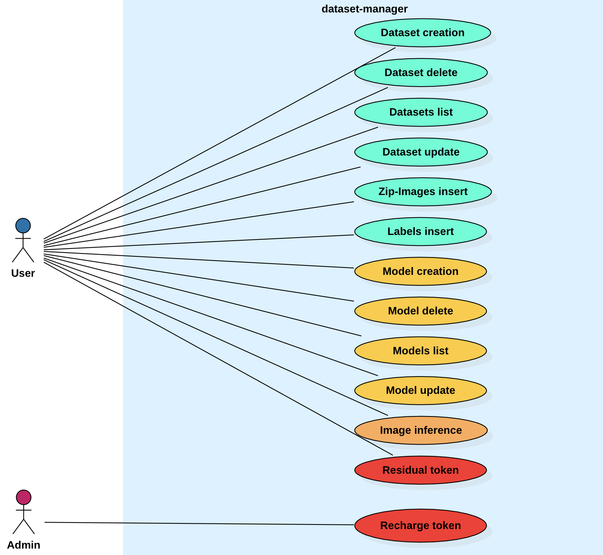
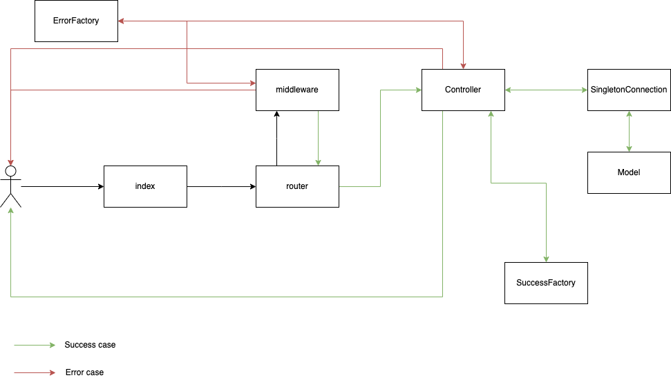

# Dataset Manager

# Team Work
- Mele Alessandro
- Traini Davide

# Requisiti
- Docker;
- Node.JS
- Postman;

# Descrizione ed obiettivi di progetto
Si realizzi un sistema che consenta di gestire dati circa attività di annotazione di data-set ed inferenza a partire da modelli pre-addestrati. Devono essere predisposte le seguenti rotte:<br />
- [U] + Creazione di un data-set (fornire metadati minimi come nome ed una serie di tag sotto forma di lista di parole e numero di classi); all’inizio il data-set risulta vuota.
- [U] Cancellazione (logica) di un data-set
- [U] + Ottenere la lista dei data-set
- [U] Aggiornamento di un data-set (con verifica della non sovrapposizione con progetti dello stesso utente con lo stesso nome)
- [U] Inserimento di contenuti all’interno del data-set
    - Caricamento di una immagine
    - Caricamento di un zip contenti immagini
    - Per ogni immagine caricata deve essere restituito un uuid che consente poi di associare all’immagine una o più label (nel casto di upload da zip si restituisca una lista di uuid o similare a scelta degli studenti.
    * Il costo associato ad ogni immagine è di 0.1token; deve essere verificato se il credito disponibile è sufficiente a gestire la richiesta.
- [U] Creazione di una o più label per una immagine
    * Per ogni etichetta prevedere la possibilità di associare anche il bounding box;necessario per ogni etichetta specificare la classe.
    * Per ogni label si applica un costo di 0.05token; deve essere verificato se il credito disponibile è sufficiente a gestire la richiesta.
- [U] Estendere la chiamata sopra al caso di più immagini
- [U] + Creazione di un modello (fornire metadati minimi come nome ed il rif. al data-set)
- [U] + Caricamento di un file di modello associato ad modello creato.
- [U] Cancellazione (logica) di un modello
- [U] + Ottenere la lista dei modelli
- [U] + Aggiornamento di un modello (con verifica della non sovrapposizione con modelli dello stesso utente con lo stesso nome); aggiornamento può essere sui metadati o sul file del modello.
- [U] Effettuare una inferenza su una immagine che viene passata al back-end; l’utente specifica l’id
  del modello da usare (nel vostro caso si usi come rete quella dell’esame di CV&DL). Restituire JSON contenente i dettagli dell’inferenza (es. classe o lista di bbox)
  
    * Ogni richiesta di inferenza ha un costo di 5 token. L’inferenza ha luogo se i crediti associati all’utente sono sufficienti.
- [U] + Restituire il credito residuo di un utente (necessaria autenticazione mediante token JWT)
dove [U] corrisponde ad una rotta autenticata mediante JWT.

I dati di cui sopra devono essere memorizzati in un database esterno interfacciato con Sequelize. <br />La scelta del DB è a discrezione degli studenti. <br />
Le richieste devono essere validate.<br />
Ogni utente autenticato (ovvero con JWT) ha un numero di token (valore iniziale impostato nel seed del database).<br />
Nel caso di token terminati ogni richiesta da parte dello stesso utente deve restituire 401 Unauthorized.<br />
+ Prevedere una rotta per l’utente con ruolo admin che consenta di effettuare la ricarica per un utente fornendo la mail ed il nuovo “credito” (sempre mediante JWT).<br />
Il numero residuo di token deve essere memorizzato nel db sopra citato. <br />
Si deve prevedere degli script di seed per inizializzare il sistema.<br />
Si chiede di utilizzare le funzionalità di middleware.<br />
Si chiede di gestire eventuali errori mediante gli strati middleware sollevando le opportune eccezioni.<br />
Si chiede di commentare opportunamente il codice.<br />

# Progettazione

## Diagrammi UML
### Diagramma dei casi d'uso


### Diagramma strutturale



## Pattern utilizzati

## Factory

## Singleton

## Middleware

# Rotte
Metodo | Rotta | Tipologia Utente | Autenticazione JWT | Body della richiesta|
--- | --- | --- | --- | --- |
POST | /user/signup | guest | NO | JSON |
POST | /user/login | user/admin | NO | JSON |
GET | /user/residualToken | user/admin | YES | JSON |
POST | /user/updateToken | admin | YES | JSON |
POST | /model/create | user/admin | YES | JSON |
POST | /model/loadFile | user/admin | YES | FORM |
GET | /model/list | user/admin | YES | JSON |
PUT | /model/updateMetadata | user/admin | YES | JSON |
PUT | /model/updateFile | user/admin | YES | FORM |
DELETE | /model/delete | user/admin | YES | JSON |
POST | /model/inference | user/admin | YES | JSON |
PUT | /dataset/create | user/admin | YES | JSON |
PUT | /dataset/update | user/admin | YES | JSON |
GET | /dataset/list | user/admin | YES | JSON |
DELETE | /dataset/delete | user/admin | YES | JSON |
POST | /dataset/zip | user/admin | YES | FORM |
POST | /dataset/image | user/admin | YES | FORM |
POST | /dataset/label | user/admin | YES | JSON |
POST | /dataset/labelList | user/admin | YES | JSON |

## Descrizione rotte 

Tutte le rotte contrassegnate con *JWT* necessitano di un token di autenticazione, in caso contrario viene restituito un messaggio con codice 401.  
Tutte le rotte contrassegnate con *JSON* necessitano di un body sotto forma di JSON.  
Tutte le rotte contrassegnate con *FORM* necessitano di un body sotto forma di FORM.  
Nel caso in cui non siano presenti i parametri obbligatori nella richiesta, vengono sollevate le dovute eccezioni. Tutti i parametri sono obbligatori, tranne quelli esplicitamente definiti come opzionali.  
Nel caso in cui si inseriscano parametri fuori dai range di ammissibilità (stringhe troppo lunghe, interi troppo grandi etc etc) vengono sollevate le dovute eccezioni.  

### /user

#### /signup (JSON)

Rotta attraverso la quale è possibile registrarsi nel sito inserendo i parametri opportuni.
Input:
- email: email dell'utente
- username: username dell'utente
- password: password dell'utente

Errori:
- Inserimento di un username già in uso: 404

Esempio di richiesta:

```json
{
    "email": "franco.rossi@hotmail.it",
    "username": "franco",
    "password": "secret"
}
```

#### /login (JSON)

Rotta attraverso la quale è possibile generare un proprio JWT attraverso il quale autenticare le proprie chiamate. 
Input:
- email: email dell'utente
- username: username dell'utente
- password: password dell'utente
- role: ruolo dell'utente (user/admin)

Errori: 
- Username non presente nel database o password non corretta: 400

Esempio di richiesta:


```json
{
    "email": "admin@admin.it",
    "username": "admin",
    "role":"admin",
    "password": "password1"
}
```


#### /residualToken (JWT, JSON)

Rotta attravero la quale l'utente può accedere al numero di token rimasti. Non sono necessari parametri nella richiesta


#### /updateToken (JWT, JSON)

Rotta attraverso la quale l'admin ha la possibilità di aggiornare il numero di token in possesso di uno degli altri utenti registrati.
Input:
- username: username dell'utente

Errori:
- Nessun utente con lo username fornito: 404 

Esempio di richiesta:


```json
{
    "username": "user",
    "token": 80
}
```

### /model


#### /create (JWT, JSON)

Rotta attraverso la quale è possible creare un nuovo modello collegandolo ad un dataset precedentemente creato
Input:
- datasetName: nome del dataset a cui si vuole collegare il modello
- modelName: nome del modello che si vuole creare

Errori:
- L'utente non possiede alcun dataset con il nome indicato: 404 
- L'utente possiede già un model con il nome indicato: 409

Esempio di richiesta:


```json
{
    "datasetName": "occhi_ritagliati",
    "modelName": "nuovo modello"
}
```


#### /loadFile (JWT, FORM)

Rotta attraverso la quale è possibile caricare un file ed associarlo ad uno specifico modello. Per evitare problematiche di sovrapposizione dei file dei modelli, soprattutto in caso di cancellazione e creazione di un modello con lo stesso nome, i file sono salvati nel percorso "models/${username}/${modelName}/${modelId}/${filename}". Tale percorso sarà restituito dopo il caricamento e potrà essere utilizzato per applicare il modello ad un'immagine di input tramite la rotta */inference*
Input:
- fileName: file da associare al modello
- modelName: nome del modello a cui associare il file

Errori:
- L'utente non possiede alcune modello con il nome indicato: 404 
- Esiste già un file associato al modello: 409
- Il file non è un file python: 400


#### /updateFile (JWT, FORM)

Rotta attraverso la quale è possibile aggiornare un file associato ad uno specifico modello. 

Input:
- fileName: file da aggiornare
- modelName: nome del modello a cui associare il file

Errori:
- L'utente non possiede alcune modello con il nome indicato: 404 
- Il modello non ha alcun file associato: 404
- Il file non è un file python: 400


#### /list (JWT, JSON)

Rotta attraverso la quale l'utente può ottenere la lista dei propri modelli. Nel caso in cui l'utente non abbia alcun modello verrà restituito un errore con codice 404. Tale rotta non necessita di alcun parametro.


#### /updateMetadata (JWT, JSON)

Rotta attraverso la quale è possibile aggiornare le informazioni di un modello. 
Input:
- modelName: nome del modello del quale si vogliono aggiornare i metadati
- newModelName: nuovo nome del modello (OPZIONALE)
- datasetName: nuovo dataset a cui si vuole associare il modello (OPZIONALE) 

Errori:
- Il nuovo nome del modello corrisponde al nome di un altro modello dell'utente: 409
- Il nome del dataset a cui associare il modello non esiste: 404


Esempio di richiesta:

```json
{
    "modelName": "nome modello",
    "newModelName": "nuovo nome del modello",
    "datasetName": "occhio_dx"
}
```
#### /delete (JWT, JSON)


Rotta attraverso la quale un utente può eliminare un proprio modello con uno specifico nome. La rimozione è logica e non fisica.

Input:
- modelName: nome del modello del quale si vogliono aggiornare i metadati

Errori:
- L'utente non possiede alcune modello con il nome indicato: 404 


Esempio di richiesta:

```json
{
    "modelName": "nuovo modello"
}
```


#### /inference (JWT, FORM)


### /dataset


#### /create (JWT, JSON)

Rotta attraverso la quale è possible creare un nuovo dataset fornendo le opportune informazioni.  Verranno inoltre sollevate delle eccezioni nel caso in cui l'utente abbia già un dataset con lo stesso nome. 

Esempio di richiesta:


Input:
- datasetName: nome del dataset da creare
- keywords: lista di parole chiave associate al dataset
- classes: numero di classi nel dataset

Errori:
- L'utente possiede già un dataset con il nome indicato: 409


Esempio di richiesta:

```json
{
    "datasetName": "dataset nuovo",
    "keywords": ["cane", "gatto"],
    "classes": 2
}
```


#### /update (JWT, JSON)

Rotta attraverso la quale è possibile aggiornare le informazioni di un dataset. 
Input:
- datasetName: nome del dataset del quale aggiornare le informazioni
- newDatasetName: nuovo nome del dataset (OPZIONALE)
- keywords: lista di parole chiave associate al dataset (OPZIONALE)
- classes: numero di classi nel dataset (OPZIONALE)

Errori:
- L'utente possiede già un dataset con il nome indicato: 409


Esempio di richiesta:

```json
{
    "datasetName": "nome del dataset",
    "newDatasetName": "nuovo nome del dataset",
    "classes": 60
    "keywords": ["canarino"]
}
```


#### /list (JWT, JSON)

Rotta attraverso la quale l'utente può ottenere la lista dei propri dataset. Tale rotta non necessita di alcun parametro. Il JSON restituito dal server contiene informazioni riguardo il dataset e le immagini che lo compongono, ognuna con le rispettive labels  


#### /delete (JWT, JSON)

Rotta attraverso la quale un utente può eliminare un proprio dataset con uno specifico nome. La rimozione è logica, quindi il dataset rimane salvato nel database, ma l'utente non ha più la possibilità di accederci, inoltre vengono eliminate in cascata le immagini e le keywords associate al dataset.

Input:
- datasetName: nome del dataset da eliminare

Errori:
- L'utente non possiede alcun dataset con il nome indicato: 404


Esempio di richiesta:

```json
{
    "datasetName": "nome del dataset",
}
```

#### /image (JWT, FORM)

Rotta attraverso la quale un utente inserisce un'immagine da associare ad uno specifico dataset. Per evitare problematiche di sovrapposizione delle immagini, soprattutto in caso di cancellazione e creazione di un dataset con lo stesso nome, i file sono salvati nel percorso "datasets/${username}/${datasetName}/${datasetId}/${filename}". Tale percorso sarà restituito dopo l'inserimento e potrà essere utilizzato per assegnare una o più etichette alla classe

Input:
- fileName: immagine
- datasetName: nome del dataset a cui associare l'immagine

Errori:
- L'utente non possiede alcune dataset con il nome indicato: 404 
- Token insufficienti: 401
- Il file non è un'immagine: 400
- Il dataset contiene già un'immagine con questo nome: 409


#### /zip (JWT, FORM)

Rotta attraverso la quale un utente inserisce uno zip contenente immagini da inserire in uno specifico dataset.


Input:
- fileName: file zip contenente le immagini
- datasetName: nome del dataset a cui associare le immagini

Errori:
- L'utente non possiede alcune dataset con il nome indicato: 404 
Il server risponde con un array JSON contenente un elemento per ogni elemento nello zip, le possibili risposte dipendono dall'esito dell'inserimento dell'immagine:
- Token insufficienti
- Il file non è un'immagine
- Il dataset contiene già un'immagine con questo nome
- L'immagine è stata caricata con successo


#### /label (JWT, JSON)

Rotta attraverso la quale l'utente può associare un'etichetta ad una specifica immagine. L'utente può decidere se inserire solamente l'etichetta di classe o se inserire anche un bounding box, in tal caso è necessario inserire tre parametri: altezza, larghezza e centro.

Input:
- imagePath: path dell'immagine alla quale associare la classe
- className: nome della classe da associare all'immagine
- center: posizione centrale del BB (OPZIONALE)
- width: larghezza del BB (OPZIONALE)
- height: altezza del BB (OPZIONALE)

Errori:
- L'utente non possiede alcuna immagine con il path indicato: 404
- I bounding boxes non sono normalizzati: 400
- Token insuffiecienti: 401
- Esiste già una label con gli stessi valori associata all'immagine

Esempio di richiesta:

```json
{
    "className": "gatto",
    "height": 0.3,
    "center": 0.3,
    "width": 0.444,
    "imagePath":"/datasets/user/1/img_1.png"
}
```


#### /labelList (JWT, JSON)

Rotta attraverso la quale l'utente può associare una lista di etichette ad una o più immagini. Per ogni elemento dell'array l'utente può decidere se inserire solamente l'etichetta di classe o se inserire anche un bounding box definito attraverso 3 parametri: altezza, larghezza e centro; 


Input, un array costituito da:
- imagePath: path dell'immagine alla quale associare la classe
- className: nome della classe da associare all'immagine
- center: posizione centrale del BB (OPZIONALE)
- width: larghezza del BB (OPZIONALE)
- height: altezza del BB (OPZIONALE)

Errori:
- L'utente non possiede alcuna immagine con il path indicato: 404
Il server risponde con un array JSON contenente un elemento per ogni elemento nel vettore di input, le possibili risposte dipendono dall'esito dell'inserimento della label:
- Token insufficienti
- L'utente non possiede alcuna immagine con il path indicato: 404
- I bounding boxes non sono normalizzati: 400
- Esiste già una label con gli stessi valori associata all'immagine
- L'immagine è stata caricata con successo


Esempio di richiesta:

```json
[
    {
        "className": "classe 4",
        "height": 0.1,
        "center": 0.4,
        "width": 0.3,
        "imagePath": "/datasets/1/user/img_1.png"
    },
    {
        "className": "classe 7",
        "height": 0.3,
        "center": 0.4,
        "width": 0.2,
        "imagePath": "/datasets/1/user/img_1.png"
    }
]
```


# Configurazione

## Avvio del progetto

Per avviare il progetto è necessario eseguire, posizionandosi nella directory di progetto:

```
cd dataset-manager
docker-compose -f docker-compose.yml -f docker-compose.prod.yml up 
```

## Testing 

Esempi di chiamate:


